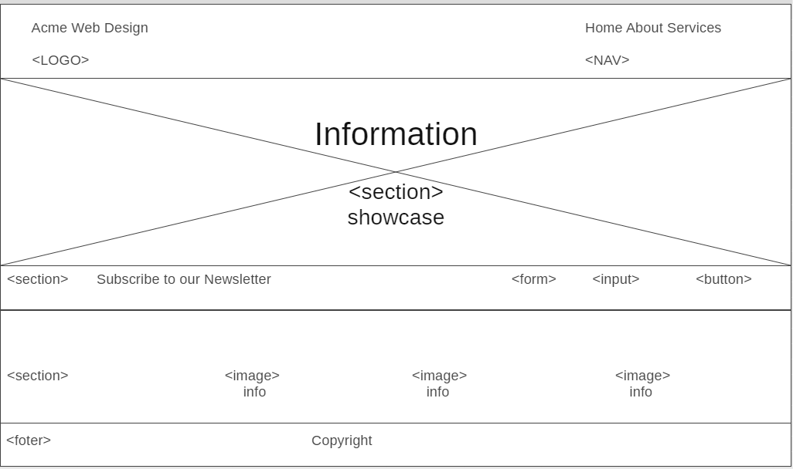

# Development Strategy

> `acme-web-design`

- Webpage about affordable professional websites
- for visitors who want to owe websites
- easy navigation

## Wireframe

<!-- include a wireframe for your project in this repository, and display it here -->
<!-- wireframe.cc is a good site for getting started with wireframes -->

## 0. Set-Up
__A User can see [Repository](https://github.com/LiubovPlugar/acme-web-design) and [live demo](https://LiubovPlugar.github.io/acme-web-design/)__

### Branch

1. Create a new repository [generated](https://github.blog/2019-06-06-generate-new-repositories-with-repository-templates/) from [this template](https://github.com/hackyourfuturebelgium/w3-validation-template)
1. Clone the repository
1. Change `development-strategy.md` file
1. Add [Wireframe](./wireframe.gif)
1. Start  README file
1. Push the changes
1. Turn on GitHub Pages

## 1. Home 

__Acme Web Design Welcome__

### Branches

1. This user story was developed on a brach called `home`
2. It was merged to `master` when the feature was finished.

### HTML

- Create `index.html` file
- `Header` element with a title describing the web page
- `Navigation bar` with `ul` list
- `Form` with `ìnput` and `button`
- `Section` with `ìmg` and information about the services
- `footer`

### CSS

- Styling the elements: `Body`, `Global`, `Header`, `Showcase`, `Newsletter`, `Boxes`

## 2. About 

__Acme Web Design About__

### Branches

1. This user story was developed on a brach called `about`
2. It was merged to `master` when the feature was finished.

### HTML

- Add `about.html` file
- `Section`element
- `Article` element
- `Aside` element

### CSS

- Styling for the new elements : `Global`, `Main-col`, `Sidebar`

## 3. Services

__Acme Web Design Services__

### Branches

1. This user story was developed on a brach called `services`
2. It was merged to `master` when the feature was finished.

### HTML

- Change `section` element
- Change `article` element and add `ul`list services
- Change `aside` element with other name

### CSS

- Styling for the new element: `Services`

## Finishing Touches

- Write final, complete README:
  - [makeareadme.com](https://www.makeareadme.com/)
  - [bulldogjob](https://bulldogjob.com/news/449-how-to-write-a-good-readme-for-your-github-project)
  - [meakaakka](https://medium.com/@meakaakka/a-beginners-guide-to-writing-a-kickass-readme-7ac01da88ab3)
- Validate code to check for any last mistakes